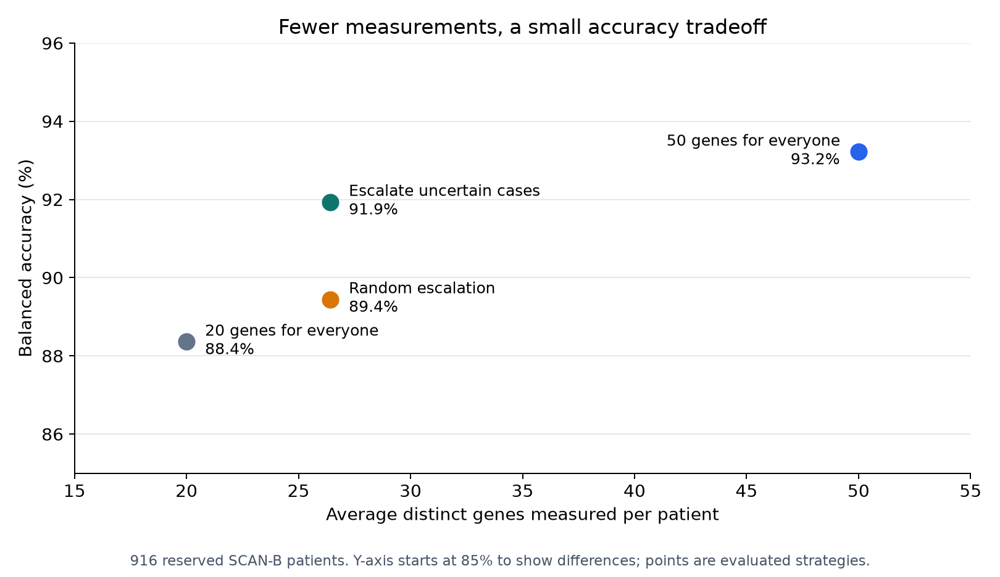
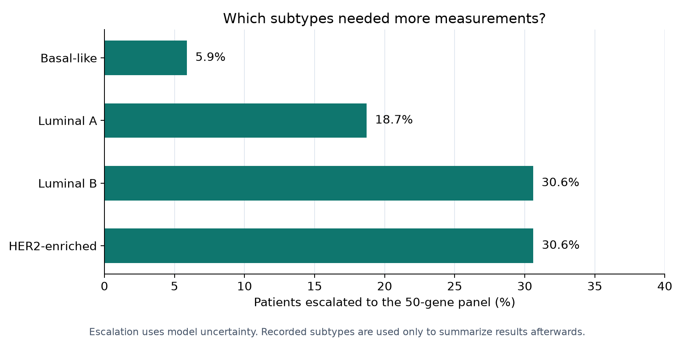

# How many genes are enough?

A personal data science project exploring whether breast cancer subtype classification needs the same number of gene measurements for every patient.

**Start with 20 genes. Use the full 50-gene panel when the model is uncertain.**

## The result

On 916 reserved patients from the independent SCAN-B cohort, the staged approach achieved **91.9% balanced accuracy**, compared with **93.2%** when all 50 genes were used for everyone. It measured **26.4 genes per patient on average**, a **47.2% reduction**. About one in five patients needed the larger panel.

| Approach | Average genes | Balanced accuracy |
| --- | ---: | ---: |
| Fixed small panel | 20.0 | 88.4% |
| Random escalation | 26.4 | 89.4% |
| Uncertainty-based escalation | 26.4 | 91.9% |
| Fixed full panel | 50.0 | 93.2% |

The interesting finding: uncertainty helped target extra measurements to patients who benefited more than patients selected at random. Escalation rates also varied by subtype, with Luminal B and HER2-enriched cases escalated most frequently.

The staged approach sits between the small and full panels: fewer measurements than the full panel, with a modest accuracy loss.

## How it works

The first model uses 20 genes selected from PAM50, an established 50-gene breast cancer signature. If its two leading subtype scores are close, a second model uses all 50 genes. The first 20 measurements are reused, so escalation adds only 30 genes.

Gene selection uses ANOVA; prediction uses random forests. The routing rule was chosen using development data and frozen before testing. Balanced accuracy averages performance across the four subtypes so larger groups do not dominate the score.

## Explore the project

- **[Results](reports/staged_research_conclusion.md):** the findings and the experiments behind them.
- **[Methods](reports/README.md):** a short guide to the technical records.
- **[Data and reproduction](data/README.md):** sources, preparation, and analysis commands.
- **[Setup](SETUP.md):** install the environment and run the analyses.

## The experiments

The project began with full-gene models and automatically selected panels in TCGA. Two initial staged designs saved measurements but missed the planned accuracy target. A PAM50-based strategy with a more conservative routing rule was then developed in SCAN-B and evaluated on a fresh holdout. All results, including the unsuccessful designs, remain in the project.

## Limitations

The observed loss was 1.28 percentage points, meeting the practical 2-point target, but its 95% uncertainty interval allowed a loss of up to 2.33 points. Equivalence is not established. The comparison uses random forests trained on PAM50 genes, not the original PAM50 classifier or clinical assay. SCAN-B models were retrained within that cohort; this is strategy replication, not direct TCGA model transfer. Gene counts simulate measurement burden, not validated laboratory savings. This portfolio project is not a clinical tool.

## Implementation

Python, pandas, scikit-learn, XGBoost, and matplotlib. Development used AI-assisted coding. The repository includes source code, fixed protocols, aggregate results, and reproducible analysis steps. Patient-level data and model binaries are excluded from Git.
