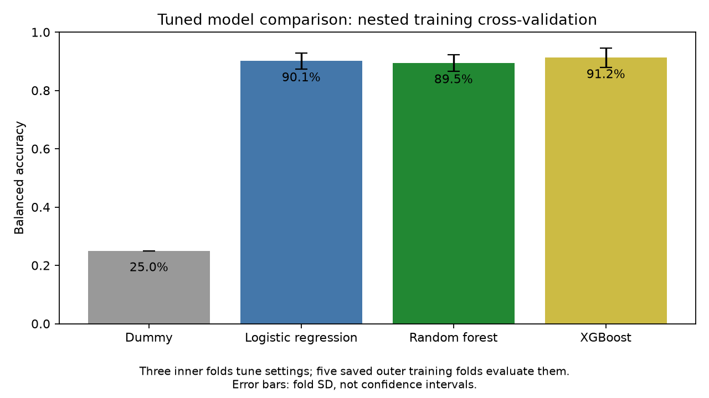
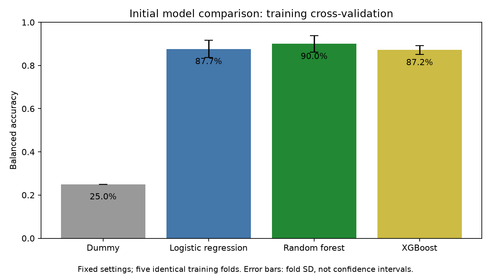

# How few genes are enough?

A beginner-friendly investigation of how small a gene-expression panel can reproduce breast cancer molecular subtype labels while retaining performance close to a full-transcriptome classifier.

## Current stage

All 945 retained patients have expression data; identifier cleanup leaves 20,481 unique gene features. A fixed stratified split reserves 756 samples for training and 189 for final testing. Bounded nested tuning reaches **90.1% balanced accuracy for L1 logistic regression, 89.5% for random forest, and 91.2% for XGBoost**, versus 25% for the dummy, using five saved outer training folds and three inner folds. No small gene panel or test performance has been evaluated. See [SETUP.md](SETUP.md), [data/README.md](data/README.md), and `notebooks/05_nested_model_tuning.ipynb`.

Settings are selected within three inner folds and evaluated on five saved outer training folds; error bars show fold SD, not confidence intervals. These small searches do not establish statistical superiority. Logistic formulation and tree compute budgets differ from the initial models below.

Initial models are compared on five identical training folds; error bars show fold standard deviation, not confidence intervals.

## Planned approach

- Use TCGA-BRCA PanCancer Atlas expression data and verify the available subtype labels.
- Compare gene-panel sizes using balanced accuracy: the average of the fraction correctly classified within each subtype.
- Choose the panel using training data only, then evaluate it on a separate test set.
- Compare a majority-class baseline, logistic regression, random forest, and XGBoost.

The user approved the panel-selection tolerance on October 9, 2026, before panel-size results were generated: select the smallest evaluated panel whose mean training cross-validation balanced accuracy is within 2 absolute percentage points of the corresponding full-gene reference. This is a practical project criterion, not proof of clinical equivalence or statistical noninferiority. See `data/panel_protocol.json`.

## Folders

- `data/`: download instructions; original and processed data stay local.
- `notebooks/`: step-by-step analyses and explanations.
- `src/`: reusable Python code.
- `figures/`: plots produced by the analysis.

## Limitations

- TCGA subtype labels were derived from PAM50, so strong performance is expected and is not a discovery.
- Results will come from one cohort, with no external validation.
- This is an educational project, not a clinical tool.
- A small computational feature set is not a validated laboratory assay.
- Source expression values were batch-normalized before download; this upstream processing cannot be refitted within our training folds.
- Gene rows with ambiguous repeated Entrez IDs were excluded, potentially removing useful measurements.

Target completion: October 31, 2026.
