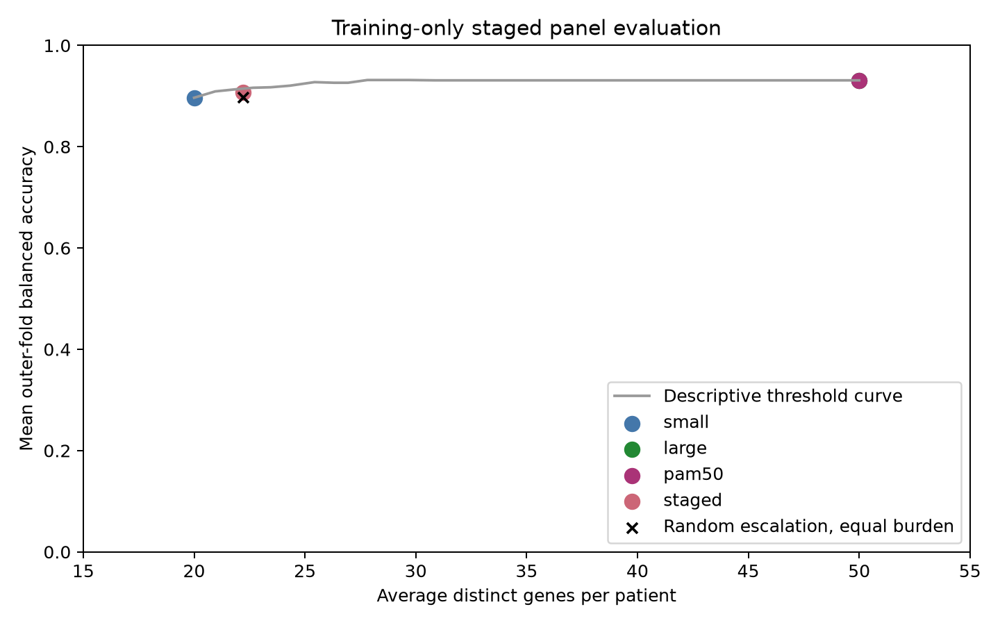

# PAM50-restricted staged development findings

## Results

| Strategy | Average genes | Mean outer balanced accuracy |
| --- | ---: | ---: |
| Fixed 20-gene PAM50 subset | 20.0 | 89.7% |
| Random escalation, matched burden | 22.2 | 89.8% |
| Uncertainty escalation to 50 genes | 22.2 | 90.8% |
| Fixed 50-gene PAM50 list | 50.0 | 93.1% |

The staged strategy escalated 56 of 756 training patients (7.4%) and reduced average gene count by 55.6% relative to using all 50 genes. Its 2.33-point loss narrowly missed the fixed 2-point target. Among escalated patients, 12 errors were corrected, three were introduced, and eleven remained incorrect. The larger-pipeline and standalone PAM50 predictions matched exactly in this run.

## Finding across both experiments

Changing panel content improved the tradeoff substantially: the PAM50-based staged approach used fewer genes and achieved higher accuracy than the automatic all-gene staged design. In both designs, uncertainty routing outperformed random escalation at matched measurement burden. Neither design met the planned accuracy-retention criterion in outer validation.

This suggests that panel content and the reliability of the routing rule matter together. A threshold that satisfies the 2-point rule within its development predictions may not preserve that margin in new validation patients. These observations support investigating a more conservative prespecified routing rule, rather than selecting a favorable threshold from the outer result curve.

## Limitations and remaining work

These results are training-only development evidence and do not establish a clinically usable workflow or novel assay. This follow-up was motivated by the first experiment, so it is not independent confirmation. Fixed gene counts, uncalibrated probability margins, and a single model family were used. Gene counts exclude laboratory overhead. The gray threshold curve is descriptive and must not select a replacement rule. Both unsuccessful primary-target results must remain reported. A new routing design requires a recorded protocol and an independent final evaluation; the old TCGA test set cannot provide that evaluation.
