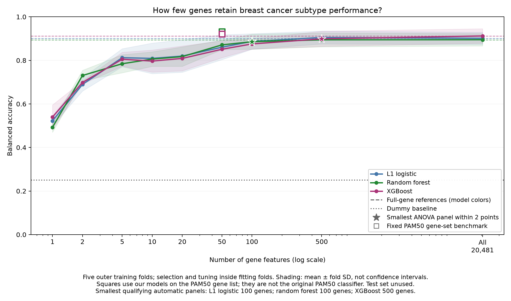
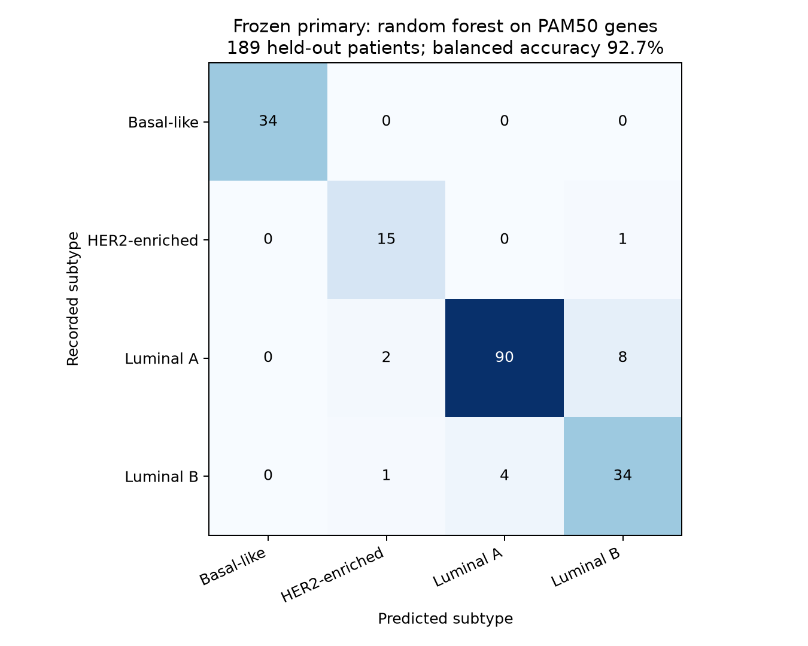
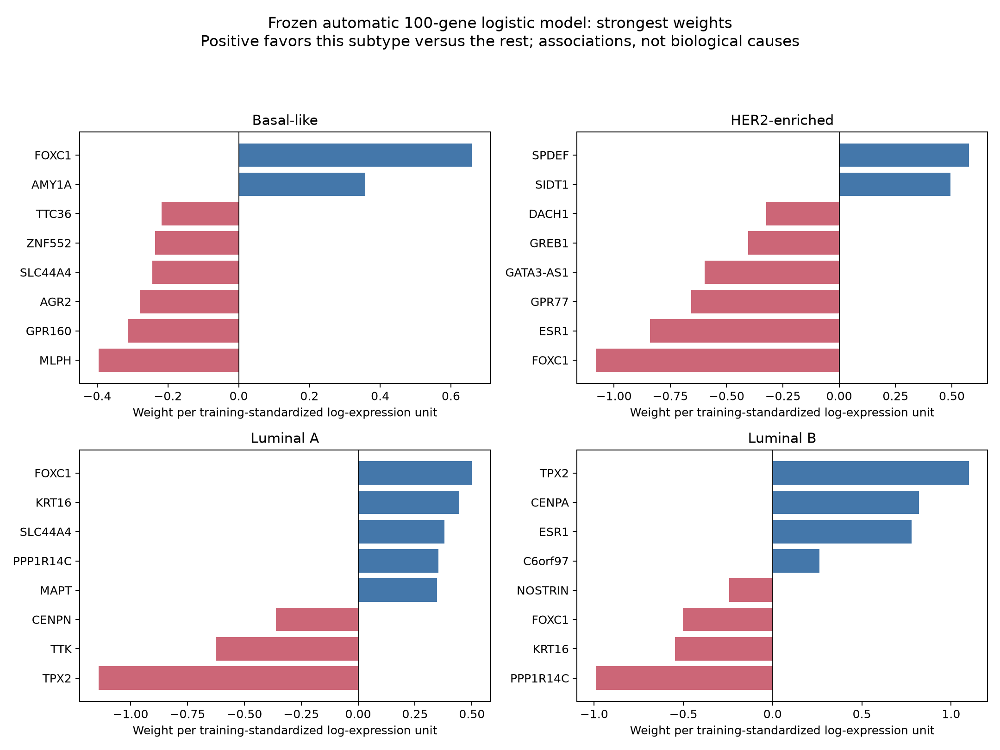
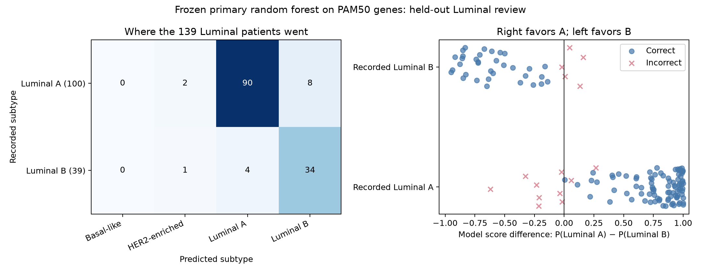

# Compact gene panels for breast cancer molecular subtype classification

Research findings • October 9, 2026

## Research question

How few gene-expression measurements can reproduce the four retained TCGA breast cancer molecular subtype labels while preserving balanced accuracy close to a full-gene model?

The central comparison is the reduction from **20,481 candidate genes to automatic panels of 100–500 genes**, alongside a fixed, biologically established **50-gene PAM50 list**. This study evaluates computational classification, not a validated laboratory assay or independent clinical diagnosis.

## Main findings

- The smallest tested automatic panels meeting the prespecified training-validation criterion used **100 genes for logistic regression, 100 for random forest, and 500 for XGBoost**. These reduce the input gene count by approximately **99.5%, 99.5%, and 97.6%**, respectively.
- On the held-out test, these automatic panels achieved **92.4%, 90.6%, and 95.4% balanced accuracy**. Each was within 2 absolute percentage points of, or above, its corresponding full-gene test result. This is a descriptive finding, not a statistical equivalence claim.
- The fixed PAM50 gene-list models performed especially well during training validation. Random forest on these 50 genes was selected as the primary model before test evaluation, scoring **92.7% balanced accuracy** on 189 held-out patients versus **93.2%** during training validation.
- The strongest supporting test result was the automatic 500-gene XGBoost model at **95.4%**. It does not replace the primary model, which was chosen before opening the test set.
- Twelve of the primary model's sixteen errors were direct Luminal A/B swaps. This resembles a recognized subtyping difficulty, but does not establish that the model's errors have the same causes as clinical classification disagreements.

## Data and study design

We used TCGA Breast Invasive Carcinoma, PanCancer Atlas, obtained through cBioPortal and its DataHub. The expression values are continuous, batch-normalized RNASeqV2 RSEM measurements. The 2018 study release is a historical reference cohort; this experiment does not establish performance in contemporary clinical populations.

Of 1,084 patient records, 945 had one of the four retained subtype labels: Luminal A (499), Luminal B (197), Basal-like (171), and HER2-enriched (78). Normal-like (36) and missing labels (103) were excluded from the four-class analysis. All retained patients had matched primary-tumor expression samples. Identifier cleanup excluded all 50 rows involved in ambiguous repeated Entrez IDs, leaving 20,481 candidate gene features. No retained expression measurements were missing, nonfinite, or negative.

A fixed, patient-disjoint, stratified split with random seed 42 reserved 756 patients for training and 189 for final testing. Test composition was Luminal A 100, Luminal B 39, Basal-like 34, and HER2-enriched 16. No test patients were used to choose panel sizes or model settings.

## Methods in plain language

**Balanced accuracy** averages the percentage correctly classified within each of the four subtypes, giving each subtype equal weight. **Macro F1** averages a score that considers both missed cases and incorrect assignments for each subtype. Ordinary accuracy was reported separately because it can be dominated by the larger Luminal A group.

The majority-class dummy always predicted Luminal A. Its balanced accuracy was 25%, despite ordinary test accuracy of 52.9%, illustrating why ordinary accuracy alone is insufficient.

The three model families were L1 one-versus-rest logistic regression, class-balanced random forest, and class-weighted XGBoost. Settings were chosen from small, bounded search grids. Five saved outer training folds assessed performance; three inner folds chose model settings within each outer fitting set. Log transformation, near-constant gene filtering, logistic scaling, supervised selection, and class weights were fitted within each fitting set. Source batch normalization occurred upstream and could not be refitted within these folds.

Automatic panels used ANOVA ranking, which favors genes whose average expression differs across the subtype groups relative to variation within each group. We tested 1, 2, 5, 10, 20, 50, 100, and 500 genes. The ranking was recalculated inside every inner and outer fit, preventing validation labels from influencing gene selection. It evaluates genes individually and can retain redundant genes.

Before viewing panel-size results, we fixed this rule: choose the smallest tested automatic panel whose mean training balanced accuracy is no more than **2 absolute percentage points below** its corresponding full-gene reference. This identifies a practical panel size among those tested; it does not prove the smallest possible panel or statistical noninferiority.

For the PAM50 comparison, we matched the published fixed list by Entrez identifier and trained our same models on those 50 genes using the same validation design. **These are models using PAM50 genes, not implementations of the original PAM50 centroid classifier or Prosigna assay.**

After training comparisons, the primary model and all supporting candidates were frozen. Final automatic gene lists and settings were learned from the 756 training patients only. Saved compact predictors were checked against the fitted training pipelines before evaluating the 189 test patients once. Subsequent gene and error reviews were descriptive; no model was retuned.

## Performance comparison

Training values are means across the five outer folds. Test values come from a single fixed holdout. The primary model is random forest on the fixed PAM50 gene list.

| Model | Gene set | Input genes | Training balanced accuracy | Test balanced accuracy | Test macro F1 |
| --- | --- | ---: | ---: | ---: | ---: |
| L1 logistic regression | Full-gene reference | 20,481 | 90.1% | 93.7% | 93.6% |
| L1 logistic regression | Automatic ANOVA panel | 100 | 88.7% | 92.4% | 89.9% |
| L1 logistic regression | Fixed PAM50 gene list | 50 | 92.4% | 92.3% | 91.9% |
| Random forest | Full-gene reference | 20,481 | 89.5% | 88.7% | 88.8% |
| Random forest | Automatic ANOVA panel | 100 | 88.6% | 90.6% | 88.7% |
| Random forest | Fixed PAM50 gene list | 50 | 93.2% | 92.7% | 91.0% |
| XGBoost | Full-gene reference | 20,481 | 91.2% | 94.4% | 93.9% |
| XGBoost | Automatic ANOVA panel | 500 | 89.9% | 95.4% | 94.6% |
| XGBoost | Fixed PAM50 gene list | 50 | 92.1% | 92.1% | 90.0% |
| Majority-class dummy | No gene information | 0 | 25.0% | 25.0% | 17.3% |

Full-gene pipelines receive 20,481 candidate features and apply their fitted near-constant filters. Automatically selected fold-specific lists can differ from the final lists selected using all training patients. Fold standard deviations in the performance curve describe variation across folds, not confidence intervals. Differences between these point estimates do not establish statistical superiority.

The curve shows the tradeoff that motivated this project. Small panels initially lose performance; larger compact panels approach the full-gene references. Stars mark the smallest tested automatic panels meeting the rule. Squares show the fixed PAM50 benchmarks. Lines connect evaluated sizes and do not demonstrate performance at untested intermediate sizes. This remains a training-validation graph; the test was not used to generate a size-selection curve.

## Primary model: where it succeeds and fails

The 50-gene random forest correctly classified **173/189 patients**, giving **91.5% ordinary accuracy**, **92.7% balanced accuracy**, and **91.0% macro F1**. The balanced accuracy is higher than ordinary accuracy because it gives the smaller, well-classified subtypes equal weight.

| Recorded subtype | Correct / total | Recall |
| --- | ---: | ---: |
| Basal-like | 34 / 34 | 100.0% |
| HER2-enriched | 15 / 16 | 93.8% |
| Luminal A | 90 / 100 | 90.0% |
| Luminal B | 34 / 39 | 87.2% |

A perfect result on 34 Basal-like patients does not establish perfect future performance. In particular, the 16 HER2-enriched test patients provide a limited estimate of that subtype's performance.

## Gene selection and interpretation

The final automatic 100-gene panels for logistic regression and random forest are identical because they use the same ANOVA ranking on the same training patients. They share **10 genes with PAM50**, including ESR1, PGR, FOXA1, FOXC1, CCNE1, and CDC20. This is 10% of the automatic panel and 20% of PAM50; no enrichment significance test was performed.

Of the 100 final genes, **83 were selected in all five outer training folds**. The 500-gene XGBoost panel overlaps PAM50 by **31 genes**, with **396 final genes selected in every outer fold**. This supports repeatability within the training cohort, not reproducibility across independent studies.

ESR1 and PGR encode estrogen and progesterone receptors, respectively, providing biological context for some shared genes. Expression measurements are not equivalent to clinical receptor staining. See [NCBI ESR1](https://www.ncbi.nlm.nih.gov/gene/2099) and [NCBI PGR](https://www.ncbi.nlm.nih.gov/gene/5241/).

The supporting logistic model is easier to interpret than tree models. A positive weight raises the subtype-versus-rest score as a gene's standardized log-expression increases, holding other inputs fixed; a negative weight lowers it. FOXC1 has the largest positive Basal-like weight, while TPX2 has a strong positive Luminal B weight and negative Luminal A weight in this fitted automatic model. Correlated inputs and separate binary classifiers can produce unexpected signs. Weights describe model associations, not causal effects, unique subtype markers, or a validated biomarker ranking.

## Luminal A/B error analysis

Of 139 Luminal patients, the primary model correctly classified 124. Eight of 100 Luminal A patients were predicted as Luminal B; four of 39 Luminal B patients were predicted as Luminal A. Three additional Luminal patients were predicted as HER2-enriched. Direct A/B swaps account for **12/16 total primary-model errors (75%)**.

Error rates for the direct swaps were 8.0% for A-to-B and 10.3% for B-to-A. Their differing denominators matter, and these small samples do not establish a significant directional difference.

The model's top-two score margin was generally smaller for incorrect Luminal predictions. Median margins were 0.874 for correctly predicted Luminal A versus 0.212 for incorrectly predicted A, and 0.611 versus 0.133 for Luminal B. Five direct A/B swaps had margins below 0.05, but one had a margin of 0.621. Thus, errors included both close calls and predictions with a strong preference. These probability estimates have not been demonstrated to be calibrated, and no score threshold was selected.

Luminal A and B share hormone-related biology, and separating them is a recognized subtyping challenge. NCI describes both as hormone receptor-positive, with Luminal B often showing greater cell-division activity. Clinical studies also report disagreements between routine tissue-marker classifications and PAM50. These observations provide context, rather than an explanation proved by our experiment. Clinical marker-based categories and gene-expression subtypes are related but not interchangeable. [NCI Luminal A](https://www.cancer.gov/publications/dictionaries/cancer-terms/def/luminal-a-breast-cancer), [NCI Luminal B](https://www.cancer.gov/publications/dictionaries/cancer-terms/def/luminal-b-breast-cancer), [clinical comparison study](https://pubmed.ncbi.nlm.nih.gov/37773555/).

## What we can conclude

Within this TCGA cohort, automatic panels of 100–500 genes retained strong held-out classification performance while substantially reducing the number of input measurements. A fixed 50-gene PAM50 list also supported strong performance and gave the highest training-validation score with random forest. The results support the feasibility of compact computational panels for reproducing these recorded subtype labels.

We did not demonstrate that a newly selected panel is superior to the original PAM50 classifier, that 100 genes is a universal minimum, or that the models are ready for clinical use. The automatic 100-gene panels were less accurate than the fixed PAM50 models during training validation, highlighting the limitations of simple univariate selection and the value of an established reference panel.

## Limitations and future work

1. **PAM50-derived target labels:** the task measures agreement with an existing molecular labeling system. The fixed PAM50 benchmark shares the biological inputs used by that system; it is not an independent diagnostic ground truth.
2. **One cohort and limited holdout:** there is no external validation, and some subtype groups are small. No confidence intervals or formal noninferiority tests were estimated. Test rankings are descriptive and did not select a new primary model.
3. **Upstream processing:** source batch normalization could not be refitted within training folds; transportability across laboratories and platforms remains untested.
4. **Restricted methods:** ANOVA can retain redundant measurements; panel sizes and tuning grids were limited. Better selection methods or smaller untested panels may exist.
5. **Laboratory feasibility:** computational gene-count reduction does not establish assay cost, sample requirements, robustness, or clinical utility. Ambiguous identifier rows were excluded, and historical gene aliases remain in source annotations.
6. **Test set already used:** gene and error interpretation after testing is descriptive. Further optimization would require a new independent evaluation set. No causal biomarker discovery or treatment recommendation follows from these findings.

Future research could validate the frozen panels in an independent cohort with compatible measurements, evaluate calibration, and study selection methods that account for correlated genes. Those are future experiments, not completed findings of this project.

## Reproducibility and supporting artifacts

The project repository is [breast-cancer-minimal-gene-panel](https://github.com/anashamidoglu/breast-cancer-minimal-gene-panel). Scripts, pinned package versions, training protocols, aggregate results, final gene lists, and explanatory notebooks are tracked. Patient-level data and model binaries remain local.

Key evidence files:

- [Panel protocol](../data/panel_protocol.json) and [training panel selection](../data/panel_selection_report.json)
- [Final model freeze](../data/final_model_freeze.json), [final gene lists](../data/final_panel_genes.csv), and [held-out metrics](../data/final_test_report.json)
- [Gene interpretation](../data/gene_interpretation.md) and [Luminal review](../data/luminal_error_review.md)
- [Dataset preparation and provenance](../data/README.md)

Dataset and PAM50 reference sources: [cBioPortal TCGA study](https://www.cbioportal.org/study/summary?id=brca_tcga_pan_can_atlas_2018), [cBioPortal DataHub](https://github.com/cBioPortal/datahub/tree/master/public/brca_tcga_pan_can_atlas_2018), [original PAM50 publication](https://pubmed.ncbi.nlm.nih.gov/19204204/), and [genefu](https://www.bioconductor.org/packages/release/bioc/html/genefu.html). Download checksums and pinned reference revisions are recorded in the project data metadata.
