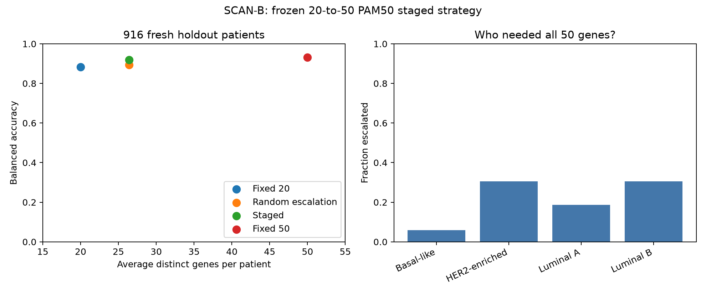

# When is a small gene panel enough?

## Research answer

A staged strategy can concentrate additional gene measurements on cases where they are more useful. In an independent SCAN-B cohort, starting with 20 training-selected PAM50 genes and escalating uncertain cases to all 50 achieved **91.9% balanced accuracy with an average of 26.4 genes per patient**, compared with **93.2% using all 50 genes for everyone**.

The observed loss was **1.28 absolute percentage points**, meeting the prespecified 2-point practical target while reducing average distinct gene count by **47.2%**. Only **196 of 916 patients (21.4%)** required the larger panel. This is a positive point-estimate result rather than a claim that the strategies are equivalent.

## How the evidence developed

| Experiment | Average genes | Staged balanced accuracy | Fixed larger panel | Loss | 2-point target |
| --- | ---: | ---: | ---: | ---: | --- |
| TCGA automatic 20-to-100, nested development | 43.5 | 86.3% | 88.5% | 2.24 points | Missed |
| TCGA PAM50-restricted 20-to-50, nested development | 22.2 | 90.8% | 93.1% | 2.33 points | Missed |
| SCAN-B PAM50-restricted 20-to-50, fresh holdout | 26.4 | 91.9% | 93.2% | 1.28 points | Met by point estimate |

The independent replication used a more conservative threshold-selection rule: allow a 1-point loss in inner development, while retaining the 2-point final target. That change was recorded before SCAN-B model performance was inspected. Five outer development folds assessed the procedure. Final models and routing threshold were fitted using 2,136 development patients, frozen and committed before evaluation on 916 holdout patients. Previous TCGA test patients were not reused.

## Fresh SCAN-B results

| Strategy | Average genes | Balanced accuracy | Macro F1 |
| --- | ---: | ---: | ---: |
| Fixed 20-gene subset | 20.0 | 88.4% | 88.2% |
| Random escalation at matched burden | 26.4 | 89.4% | — |
| Uncertainty escalation | 26.4 | 91.9% | 91.3% |
| Fixed 50-gene PAM50 model | 50.0 | 93.2% | 92.5% |

Uncertainty routing exceeded random escalation by **2.49 percentage points** at the same measurement count. Additional genes corrected **42 predictions**, introduced **16 errors**, and left **29 initially incorrect escalated predictions incorrect**. The net change versus the fixed 20-gene model was 26 additional correct predictions: 841/916 versus 815/916.

## Which cases required more information?

| Recorded subtype | Escalated | Staged recall |
| --- | ---: | ---: |
| Basal-like | 5.9% | 93.1% |
| HER2-enriched | 30.6% | 90.8% |
| Luminal A | 18.7% | 91.5% |
| Luminal B | 30.6% | 92.2% |

Measurement demand was uneven across subtypes. Most Basal-like cases stayed at the first stage, while roughly three in ten HER2-enriched and Luminal B cases required all 50 genes. This supports a more informative conclusion than a single average accuracy: additional gene information is not equally useful for every tumour, and uncertainty provides a practical way to allocate it.

## Dataset and reproducibility

Official SCAN-B GSE96058 data contained 3,273 primary cases and 136 technical replicates. Primary samples were retained, and 221 Normal-like cases were excluded from the four-class analysis. The remaining 3,052 cases were split into 2,136 development and 916 holdout cases using a fixed stratified seed. All 50 PAM50 genes mapped uniquely. Expression values were already log2(FPKM + 0.1), so no additional log transformation was applied.

The final threshold was 0.45 on the first-stage top-two probability margin. ANOVA selected the 20 genes within each fitting fold and finally on development data only. Both stages used class-balanced random forests with 200 trees and minimum leaf size 3. Escalated patients required 30 additional genes; previously measured genes were reused in the computational accounting.

Evidence: [prespecified replication protocol](scanb_replication_protocol.md), [split report](../data/scanb_split_report.json), [model freeze](../data/scanb_model_freeze.json), [final 20-gene panel](../data/scanb_final_small_panel.csv), and [fresh holdout results](../data/scanb_holdout_report.json). Original source: [NCBI GEO GSE96058](https://www.ncbi.nlm.nih.gov/geo/query/acc.cgi?acc=GSE96058). Patient-level predictions and model binaries remain local.

## Limitations

The paired stratified-bootstrap 95% interval for the staged-minus-full balanced-accuracy difference was **−2.33 to −0.37 percentage points**. It crosses the −2-point retention boundary, so the uncertainty interval does not establish performance retention within that margin, despite the point estimate meeting the target. The full-panel model was more accurate on this holdout.

This is independent-cohort replication after within-SCAN-B retraining, not direct transfer of a TCGA-fitted model. It does not isolate whether improvement over the TCGA experiments came from the conservative routing rule, larger training sample, or cohort differences. Labels were PAM50-derived, and the comparator was a random forest trained on PAM50 genes rather than the original PAM50 classifier or clinical assay. Probability margins were not validated as calibrated diagnostic probabilities.

The experiment simulates a staged measurement workflow from already-measured expression. Distinct gene counts exclude housekeeping measurements, assay overhead, turnaround time, and the cost of a second measurement stage. Source expression normalization and prior label generation were upstream. Technical replicate grouping relies on the source primary/replicate identifiers. These results establish neither clinical utility nor scientific novelty; a focused literature review and prospective independent validation would be required for those claims. No further tuning should use the now-opened SCAN-B holdout.
