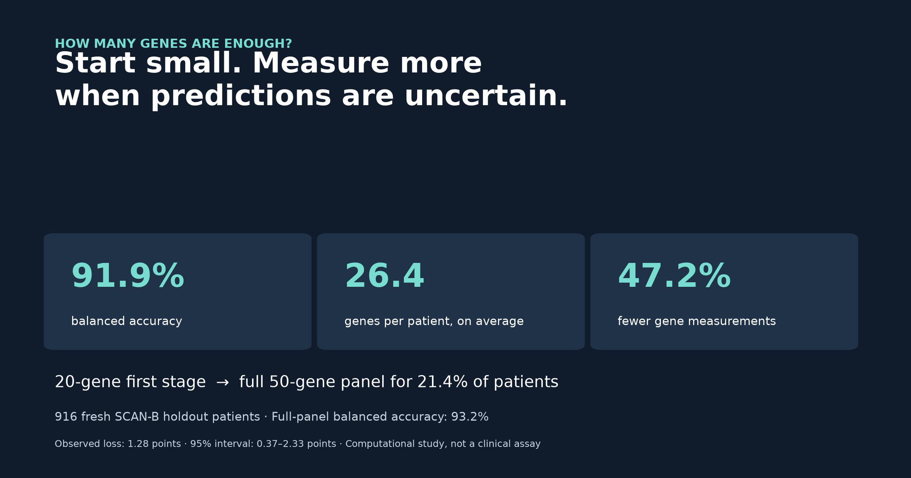

# When is a small gene panel enough?

On **916 reserved SCAN-B patients**, starting with 20 PAM50 genes and expanding uncertain cases to 50 achieved **91.9% balanced accuracy**, versus **93.2%** using all 50 for everyone. The average was **26.4 genes per patient**, a **47.2% reduction**. Only **21.4%** needed the larger panel.

## What the experiment showed

Uncertainty routing scored 91.9%, versus 89.4% for random escalation at the same measurement count. Extra genes corrected 42 predictions and introduced 16 errors. They were useful overall, but not for every patient.

| Subtype | Escalated |
| --- | ---: |
| Basal-like | 5.9% |
| Luminal A | 18.7% |
| Luminal B | 30.6% |
| HER2-enriched | 30.6% |

The workflow does not know the subtype beforehand: escalation depends on how close the leading model scores are.

## The earlier experiments

| Experiment | Average genes | Staged score | Full-panel score |
| --- | ---: | ---: | ---: |
| TCGA automatic 20 to 100 | 43.5 | 86.3% | 88.5% |
| TCGA PAM50 subset 20 to 50 | 22.2 | 90.8% | 93.1% |
| SCAN-B PAM50 subset 20 to 50 | 26.4 | 91.9% | 93.2% |

The first two designs missed the planned 2-point target. Before SCAN-B modeling, the routing rule became more conservative. Those unsuccessful results remain part of the project.

## Method, briefly

SCAN-B was split into 2,136 development and 916 holdout patients. Technical replicates and Normal-like labels were excluded. ANOVA selected the first 20 genes from PAM50. Random forests predicted subtypes. Nested validation selected the score-gap threshold, and the final models were frozen before testing. Escalation adds 30 genes and reuses the original 20.

[Protocol](scanb_replication_protocol.md) | [Metrics](../data/scanb_holdout_report.json) | [Gene list](../data/scanb_final_small_panel.csv)

## Limitations

The observed 1.28-point loss met the practical 2-point target, but the 95% interval allowed a loss of 0.37-2.33 points. Equivalence is not established. Models were retrained within SCAN-B, so this is independent-cohort strategy replication rather than direct TCGA model transfer. The comparator uses PAM50 genes, not the original PAM50 classifier or clinical assay. Labels were PAM50-derived. Gene counts simulate measurements, not validated laboratory savings. This portfolio analysis is not a clinical tool or a claim of novelty.
