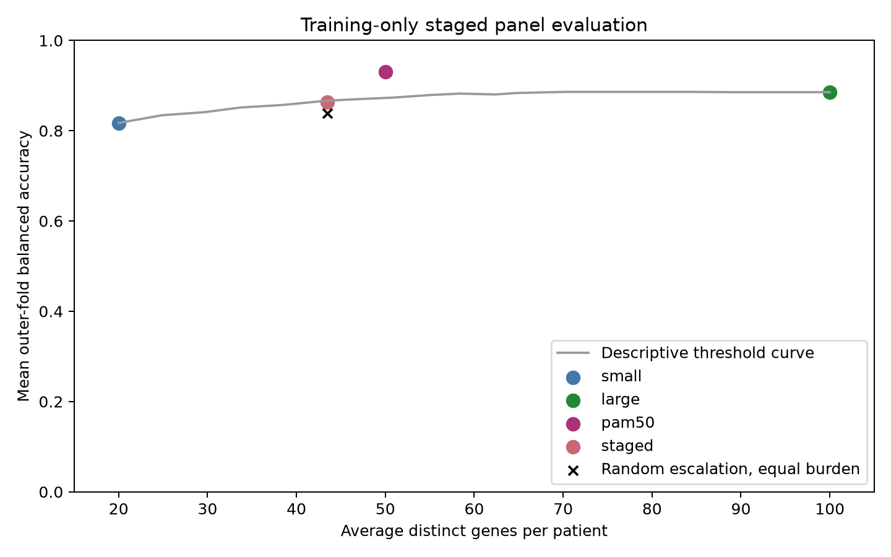

# First staged-panel experiment

## Question and design

Can uncertainty-based escalation from 20 to 100 nested automatic genes preserve classification performance while reducing average measurement burden? Random forest settings were fixed in advance. Three inner training folds selected the routing threshold; five outer training folds evaluated the complete procedure. All 756 original training patients contributed an out-of-fold prediction. The previously used test patients were not accessed.

## Results

| Strategy | Average genes per patient | Mean outer balanced accuracy |
| --- | ---: | ---: |
| Fixed small automatic panel | 20.0 | 81.7% |
| Random escalation, matched burden | 43.5 | 83.9% |
| Uncertainty-based escalation | 43.5 | 86.3% |
| Fixed PAM50 gene-list model | 50.0 | 93.1% |
| Fixed larger automatic panel | 100.0 | 88.5% |

The staged approach escalated 29.4% of patients, reducing average measurement count by 56.5% relative to measuring 100 genes for everyone. Its balanced accuracy was 2.24 absolute percentage points below the 100-gene comparator, narrowly missing the prespecified 2-point target. It exceeded matched random escalation by 2.40 points. The fixed PAM50 gene-list reference delivered substantially higher performance with 50 measurements per patient.

## Who required more genes?

| Recorded subtype | Escalated |
| --- | ---: |
| Basal-like | 1.5% |
| HER2-enriched | 16.1% |
| Luminal A | 33.6% |
| Luminal B | 48.1% |

Among escalated cases, 69 incorrect small-panel predictions became correct, 21 correct predictions became incorrect, and 31 incorrect predictions remained incorrect. Uncertainty routing therefore identified cases where extra genes were useful more effectively than random routing, but adding genes also introduced errors. The 20-gene model already recalled 97.8% of Basal-like training patients, while its Luminal B recall was 65.2%; escalation increased Luminal B recall to 77.8%.

## Interpretation

The initial automatic staged approach provides evidence that measurement needs differ across subtypes and that uncertainty can help target additional measurements. However, the tested design did not meet its primary accuracy-retention target, and the established fixed PAM50 gene list offered a stronger performance-versus-gene-count tradeoff. This result directs attention toward the content of the first-stage panel and the cases that do not benefit from escalation, rather than measurement count alone.

## Limitations and next step

These are nested training-development results, not fresh independent validation. Probability margins are uncalibrated scores. Random-routing comparisons are descriptive; no superiority test was performed. The threshold curve is an exploratory description of outer-fold predictions, not a source for choosing a replacement threshold. Classifier settings were fixed, whereas earlier results included setting searches. Gene counts simulate measurement burden and omit assay overhead. The old test set remains unsuitable for choosing this extension.

A subsequent prespecified development experiment could evaluate a small first-stage subset of PAM50, nested within all 50 genes, to determine whether biologically established panel content changes this tradeoff. That is a new hypothesis prompted by these results and would require training-only development followed by a frozen independent evaluation. No final staged model or external result has been produced.
